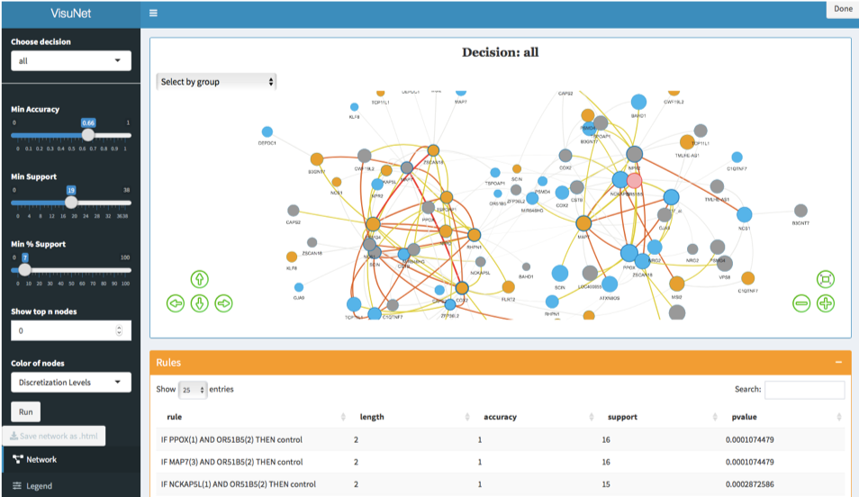
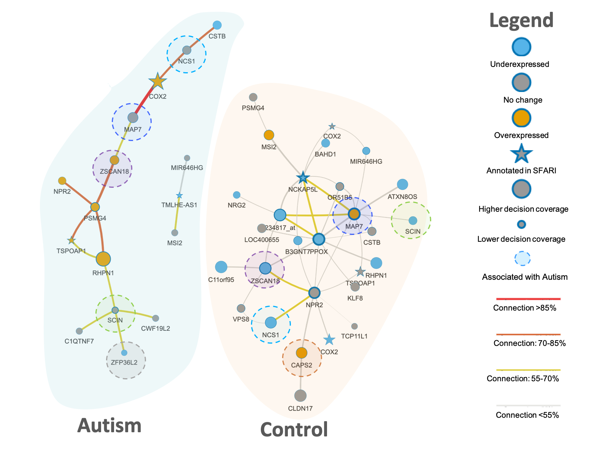
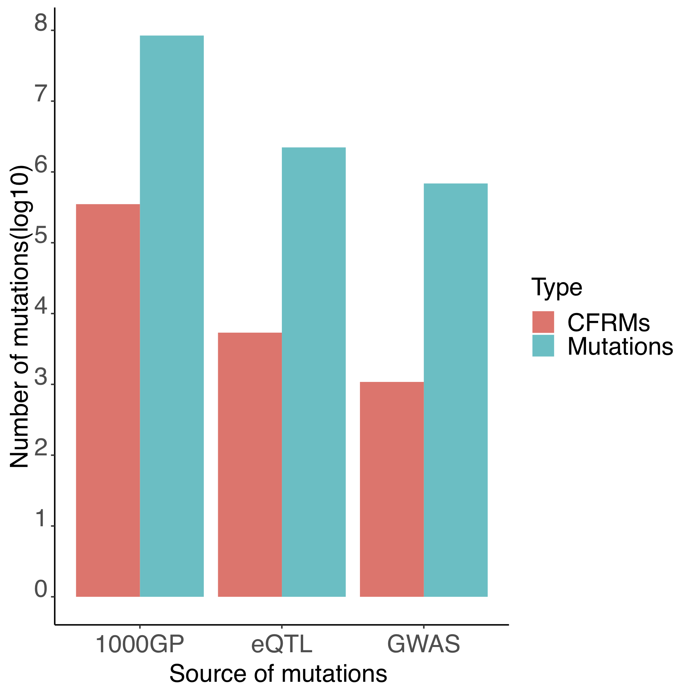
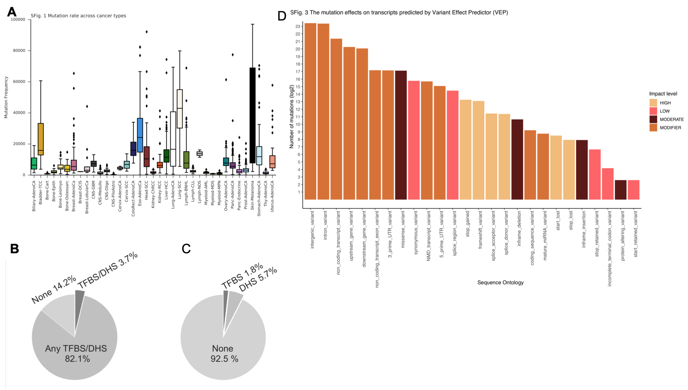

```{r setup, include=FALSE}
knitr::opts_chunk$set(widgetframe_widgetsdir = 'widgets')
library(visNetwork, quietly = TRUE)
library(widgetframe,  quietly = TRUE)
library(kableExtra, quietly = TRUE)
library(VisuNet, quietly = TRUE)
library(DiagrammeR, quietly = TRUE)
library(knitr, quietly = TRUE)
library(cowplot, quietly = TRUE)

```


## Introduction {data-background-image="images/UU-figures-en-2019copy.jpg" .emphasized}

Uncovering explainability for the complex health-related problems is a crucial task.

Large number of available data complicates the process of discovery the most informative features for the biological outcomes.
Machine learning methods can be a solution for this problem. 

We focused on developing machine learning-based methodologies that support the identifcation and interpretation of patterns from biological data and as a result two tools were implemented. The main aim of my projects was to improve the methods and apply them to large-scale experiments performed on complex diseases, e.g. cancer and autism.

<div id="left">


</div>

<div id="right">

<br>
<small>https://www.mindtheproduct.com/5-machine-learning-lessons-for-product-managers/</small>
</div>


<aside class="notes">
ML - extracting meaningful information and hidden pattern among subsets of samples  from large and complex datasets. 
Supervised/unsupervisd
Logistic regression - find the best fit line which can predict the impact of the independent variable/features on target/decision, sigmoid function, binary outcome
	</aside>


## Project 1. VisuNet: an interactive tool for network visualization of rule-based models {data-background-image="images/UU-figures-en-2019copy.jpg" .emphasized}


Explainability make classifiers biologically meaningful


Explainability:

- What interdependencies of genes/variables contribute to classification?
- What variables/genes are more important?

<aside class="notes">
Rule-based classifeirs providing computational solutions to complex problems in health-related decision tasks is explainability; RBC are transparent
</aside>

## Rule-network (RN) construction {data-background-image="images/UU-figures-en-2019copy.jpg"}


Interdependencies are discovered from transparent classifiers, such as rule-based classifiers (RBCs). 


The conjuncts are co-predictive of the decision.

Nodes - conjuncts in rules, i.e.  features with their values occurring in the rules.

Edge - connects two nodes if the corresponding conjuncts occur in the same rule. 

RNs are built for each decision (outcome class).


## VisuNet {data-background-image="images/UU-figures-en-2019copy.jpg"}


<center></center>


- RN visualization tool implemented as an R package, 
- helps identifying the strongest features and their interdependencies,
- easy to use due to an interactive interface, 
- applicable for any RBC,
- publicly available on GitHub: https://github.com/komorowskilab/VisuNet

<center></center>

<aside class="notes">
hubs
</aside>
## Applications {data-background-image="images/UU-figures-en-2019copy.jpg"}

```{r, echo =FALSE}
collapse_rows_dt <- data.frame(Dataset = c(paste0(rep("Autism (MG)", 1),footnote_marker_number(1)), 
                                           paste0(rep("SIV (FB&ZK)", 4),footnote_marker_number(2)),
                                           paste0(rep("ULSAM (KD)", 1),footnote_marker_number(3)),
                                           paste0(rep("Synthetic data (KS)",1),footnote_marker_number(4))),
                               `Data type` = c(c('gene expression  levels'),
                                               rep("gene expression levels", 4),
                                               rep("metabolite levels", 1),
                                               rep("synthetically correlated variables", 1)),
                               `N objects` = c(c('146 patients: 82 autistic and 64 healthy boys'),
                                              rep('22 Rhesus macaques:\n 10 infected in less than 4 challenges (Early) and 12 infected in more than 6 challenges (Late) with SIV after vaccination', 4),
                                              c('963 patients: 134 type 2 diabetes (T2D) and 829 non-diabetes (ND)'),
                                              rep("500 objects: 250 D1 and 250 D2",1)
                                 
                               ),
                               Decision = c(rep("Autism vs Control", 1), 
                                           rep("Early vs Late", 4),
                                           rep("ND vs T2D", 1),
                                           rep("D1 vs D2",1)),
                              Models =c( c("-"),
                              c("W0", "W16", "W32", "C1"),
                              c("-"),
                              c("100 models")),
                              `N features` = c(c(35),
                                              c(597,1068,723,448),
                                              c(19),
                                              c(25)),
                              `Model quality` = c(c('80%'),
                                                  c('95%','100%','100%','95%'),
                                              c('67%'),
                                              c('48% - 100%'))
                             
                               )


kable(collapse_rows_dt, #format = 'html', 
      align = rep("c",7),escape = F, col.names = c("Dataset",
                           "Data type",
                           "#objects",
                           "Decision",
                           "Models",
                           "#features",
                           "Rule-based model quality")) %>%
  kable_styling(full_width = T, font_size = 13,position = "center") %>%
   row_spec(1, color = "darkslategray", background = "PowderBlue") %>% 
  column_spec(1, bold = T) %>%
  column_spec(2, width = "10em") %>% 
  collapse_rows(columns = 1:4, valign = "middle") %>%
  footnote(general_title = "Data sorce",
           number = c("Alter, M.D., et al., 2011",
                      "Barrenäs, F., et al., 2019",
                      "Fall, T., et al., 2016", "Garbulowski, M., et al., 2019 ")
           )

```


<br><br>
<h5><p align="left">MG - Mateusz Garbulowski</p></h5>
<h5><p align="left">FB&ZK - Fredrik Barrenäs & Zeeshan Khaliq</p></h5>
<h5><p align="left">KD - Klev Diamanti</p></h5>
<h5><p align="left">KS - Karolina Smolinska</p> </h5>

<aside class="notes">
Expression levels of 54678 genes Affymetrix Human Genome Array
Fast Correlation-Based Filter dimensionality reduction method  (FCBF)
SIV -  simian immunodeficiency virus; acquiring protection against SIV upon vaccination of Rhesus macaques with a new sterilizing vaccine by the avian influenza virus. whole blood transcriptomic profiling, DNA prime (week 0), MVA boosts (week 16 and week 32) and C1 - SIV Challenge - W57
ULSAM - the uppsala longitudinal study on Adult men cohort- LC-MS (liquid chromatography-mass spectrometry) non targeted metablomics analysis
</aside>

## Case-control studies of autism - sample RN {data-background-image="images/UU-figures-en-2019copy.jpg"}
<div id="left2">
<iframe src='images/net_Autism_fig_new1.html' style='height:800px;width:800px'></iframe> 
</div>

<div id="right2">
<center></center>

</div>

## Case-control studies of autism - sample RN {data-background-image="images/UU-figures-en-2019copy.jpg"}

<center></center>

4 genes were previously reported in the SFARI Gene database of autism associations: COX2,  TMLHE,  NCKAP5L and TSPOAP1.
<br>Several genes identified in the literature as autism associated: MAP7,ZSCAN18, SCIN, NCS1, CAPS2, ZFP36L2.

<aside class="notes">
12 genes common, but different levels
NCKAP5L - neurodevelopmental dysfunction in autism
SCIN, NCS1 - calcium homeostasis is altered in autism disorders;CAps2 - mouse models, microdeletions cnv;
ZSCAN18, ZFP36L2 - zinc fingers;

</aside>

## MAP7 and COX2 interdependency  in autism {data-background-image="images/UU-figures-en-2019copy.jpg"}

<div id="left">
The strongest interdependency is visible between COX2 and MAP7. 
  
COX2 regulates anxiety behaviour in the mouse model (Wong, C.T., et al., 2019)

MAP7 is required for axon growth and branch formation during embryonic brain formation.
The association of MAP7 with autism and schizophrenia was previously reported (Tymanskyj, S.R., et al., 2017)

RN may suggest a link between embryonic development events and anxiety behaviour.

</div>

<div id="right">
<center></center>

</div>

## Project 1 - Summary  {data-background-image="images/UU-figures-en-2019copy.jpg"}

- VisuNet is conceptually simple, but useful for interpreting RBCs,
- RN identifies different combinations of features and their levels that are co-predictors,
- RN helps explain the differences between the decision classes,
- autism-control RN confirms genes associations with autism,
- RN may help to discover the interaction mechanisms for attributes, e.g. MAP7 and CAPS2.


The manuscript is planned to finish by the end of this year.

## Project 2: funMotifs and the functional annotation of the tissue-specific noncoding mutations {data-background-image="images/UU-figures-en-2019copy.jpg"}

The gene expression is regulated by transcription factors (TFs) through binding to TF biding sites (motifs). To understand how the genes are regulated, we need to know what determinated functionality of TF motifs. 
We tried to characterize tissue-specific functional TF motifs by incorporating data from large-scale genomics platforms including ENCODE, RoadMap Epigenomics and FANTOM. The logistic regression was applied to obtain the functionality score of TF motifs.
<br>As a consequence, funMotifs was developed by Husen M. Umer.
I was mainly working on the framework applications.
Two manuscripts were written based on the Project 2.

<center><center>

<small><p align="left">http://2013.igem.org/Team:XMU_Software/Project/promoter</p></small>

## Manuscript 1 {data-background-image="images/UU-figures-en-2019copy.jpg"}
<br><br><br>
<center><center>


## funMotifs framework {data-background-image="images/UU-figures-en-2019copy.jpg"}

<div id="left">
<b> funMotifs content:</b>

- Annotations for motifs of ~500 TFs in 15 tissues
- Annotations: 
  - TF peak, 
  - DNase1 site,
  - Chromatin state,
  - …
  
<b> Definition of candidate functional regulatory mutations (CFRMs):</b> 

In the tissue(s) relevant for the variant.

- Overlap a TF motif and change entropy by at least |0.3|,
- TF expression > 0,
- DNaseI peak,
- Functionality score > 2.5 or TF-peak.

</div>

<div id="right">


</div>
<aside class="notes">
DHSs - DNase I hypersensitive sites
The odds ratio is the probability of success/probability of failure. 
Logistic regression - find the best fit line which can predict the impact of the independent variable/features on target/decision, sigmoid function, binary outcome


</aside>

## Functional motifs distribution {data-background-image="images/UU-figures-en-2019copy.jpg"}

<center><center>

<aside class="notes">
THe average fuctional score 3.725 and sd 0.587
</aside>

## Applications {data-background-image="images/UU-figures-en-2019copy.jpg"}


<div id="left">


- SNPs and short indels from 1000 Genome project (HU & KS)
- eQTL SNPs from the GTEx data portal v7 (HU & KS)
- SNPs from GWAS Catalogue and SNPs in LD with GWAS SNPs for r^2^>0.8 (KS)


</div>

<div id="right">

</div>

<br><br><br><br><br><br><br><br><br><br><br><br><br><br><br><br><br>
<h5><p align="left">HU - Husen M. Umer</p></h5>
<h5><p align="left">KS - Karolina Smolinska</p></h5>

<aside class="notes">
84milions 1000GP - 0.26%  functional var
2milions eQTL SNPs - 0.24%
687k GWAS - - 0.17%
LD - Linkage disequilibrium - non-random association of SNPs at different loci in a given population
</aside>


## Comparison to existing annotation databases {data-background-image="images/UU-figures-en-2019copy.jpg"}

2,219,330 eQTL SNPs were annotated using funMotifs, RegulomeDB and HaploReg.

<div id="left">
```{r, echo =FALSE}
funMotifs <- c("No", "Yes", "Yes", "Yes")
RegulomeDB <- c("Yes", "Yes", "Yes", 'No')
HaploReg <-c("Yes", "No", "Yes", 'No')
data <- data.frame(funMotifs,RegulomeDB, HaploReg )
rownames(data) <- c("Genome wide","Functionality score","Functional annotations","Tissue Specificity")
knitr::kable(data)%>%
  kable_styling(font_size = 18)
```
</div>

<div id="right">
<center></center>
</div>

<br><br><br><br><br><br><br><br><br><br><br><br><br><br><br>
RegulomeDB: Boyle,A.P., et al. (2012) 

HaploReg: Ward,L.D., et al. (2016) 

## Overview of the candidate functional GWAS SNP rs8103622 in breast tissue {data-background-image="images/UU-figures-en-2019copy.jpg"}

<center></center>

<aside class="notes">
snp in 4 tissues: blood, breast, liver, myeloid
associated with 4 ld snps, 2 breast cancer risk variants
eqtl asscoted with SSBP4-  tumor-suppressor gene
MCF7 -breast cancer cell line
</aside>

## Manuscript 2 {data-background-image="images/UU-figures-en-2019copy.jpg"}

<center></center>

<b>The aim of the study</b>

Functional annotation of mutations in the Pan Cancer Analysis of Whole Genomes consortium data for 2,500 cancer genomes in 37 cancer types.

<b>Results</b>

Using the funMotifs framework we identified 121,029 CFRMs overlapped 217,075 potentially functional motifs across the 44 cohorts. 
Many CFRMs were found nearby genes that were previously linked with cancer.

## Overview of mutations {data-background-image="images/UU-figures-en-2019copy.jpg"}

<center></center>

<aside class="notes">
25 milions of mutations
B. corresponding cell line
4 milions overlapped tf-motis: 1.8% overlapped matching TF peaks.
High ditruptive effect on the protein (inclusion of coding mutations)
</aside>


## Workflow {data-background-image="images/UU-figures-en-2019copy.jpg"}

<center></center>


## CEBPB - the most significantly mutated motifs {data-background-image="images/UU-figures-en-2019copy.jpg"}

<center></center>

The active motifs of CEBPB are significantly less methylated genome-wide than inactive motifs and still there is an abundance of mutations at this site (P-value < 1e-50).

<aside class="notes">
5 cell lines: HeLa-3, HepG2,IMR-90, K562, GM12878
Active motifs: CEBPB motifs + ChIP-seq peaks from the corresponding cell line.
Methylation levels:  ENCODE WGBS experiments. t-test
</aside>

## Highly recurrent mutated regulatory elements {data-background-image="images/UU-figures-en-2019copy.jpg"}

<center></center>

<aside class="notes">
multiple neigheboring mutated motifs may affect the same regulatory elements -> mFREs;
200 bp window merged; 
local hypermutated regions, the significance of the accumulated FS of each element by comparing to a local background distribution of simulated elements within a 50Kb window;
8,716 mFREs with 20,801 CFRMs; 399 mFREs  mutated in >10 samples
GENES overlapped 2kb many cancer associated; MYC - oncogene
	</aside>

## Project 2 - Summary  {data-background-image="images/UU-figures-en-2019copy.jpg"}

- Characterization of the noncoding regions of human genome is important to understand mechanisms that lead to complex diseases,
- Functional annotations help to identify regulatory mutations that may significantly dysregulate gene expression in cancer and other complex diseases,
- funMotifs applications identified potential functional variants in cancer and normal genomes,
- Experimental validation may be performed on the CFRMs to confirm our findings


funMotifs was implemented as a command-line pipeline (https://github.com/komorowskilab/funMotifs) and a web-based interface: http://bioinf.icm.uu.se/funmotifs.

## Summary {data-background-image="images/UU-figures-en-2019copy.jpg"}

- We applied machine learning appoaches on different health-related biological problems

- We created two tools that simplified the procedure of identificationa and interpretation of a large-scale data

## Future plans {data-background-image="images/UU-figures-en-2019copy.jpg"}

- Project 1.  - implement the possibility to annotate the RN attributes using biological properties of the input datatypes and various databases, e.g. GO terms for a gene expression data. 

- Project 2. - modification of the funMotifs algorithm to improve identification of the false positive regulatory motifs. We are planning to continue research on the functional annotation of motifs. We would like to extend the functional motifs definition in terms of the conservation of the individual nucleotides in TF motifs across various diseases.   

- Project 3. - identification and visualization of interdependent genes that discern patients in the case-control studies of autism spectrum disorders by combining multiple rule-based classifiers. 

- Project 4. - identification of potential biomarkers that discern glioma subtypes using CFRMs from the COSMIC-available mutations for gliomas. Intersection of CFRMs with the differentially expressed genes based on the TCGA and GTEx databases.

##  {data-background-image="images/UU-figures-en-2019copy.jpg"}

<h5> 
**Publications: **

1.	Husen M. Umer, **Karolina Smolinska-Garbulowska**, Nour-al-dain Marzouka, Zeeshan Khaliq, Claes Wadelius, Jan Komorowski, funMotifs: Tissue-specific transcription factor motifs, 2019, bioRxiv 683722; doi: https://doi.org/10.1101/683722 (subbmited)

2.	Husen M. Umer, **Karolina Smolinska-Garbulowska**, Jan Komorowski, Claes Wadelius, Functional annotation of noncoding mutations in cancer, 2019(manuscript)

3.	Marco Cavalli, Nicholas Baltzer, Gang Pan, José Ramón Bárcenas Walls, **Karolina Smolinska Garbulowska**, Chanchal Kumar, Stanko Skrtic, Jan Komorowski, and Claes Wadelius. Studies of liver tissue identifies functional gene regulatory elements associated to gene expression, type 2 diabetes and other metabolic diseases, Human genomics 13, no. 1 (2019): 20

4.	Mateusz Garbulowski, Klev Diamanti, **Karolina Smolinska-Garbulowska**, Patricia Stoll, Susanne Bornelöv, Aleksander Øhrn, Jan Komorowski, (2019), R.ROSETTA: a package for analysis of rule-based classification models, bioRxiv 625905; doi: https://doi.org/10.1101/625905
These authors contributed equally to the work as second authors. </h5>

##  {data-background-image="images/UU-figures-en-2019copy.jpg"}


 <h5> 
**Posters:**

1.	Michal J. Dabrowski, Michal Draminski, Klev Diamanti, Mateusz Garbulowski, **Karolina Smolinska**, Jacek Koronacki, Jan Komorowski. Identification of the boundary between common and ancestry-dependent levels of gene expression of Homo sapiens adaptive immune system. Systems Biology: Networks, Cold Spring Harbor Laboratory, Cold Spring Harbor, USA 14-18 March 2017.
2.	Mateusz Garbulowski, **Karolina Smolinska**, Klev Diamanti, Patricia Stoll, Zeeshan Khaliq, Sara Younes, Behrooz Torabi, Susanne Bornelöv, Jan Komorowski. RROSETTA: a toolkit for creating rough set models. Swedish Bioinformatics Workshop 2017, Uppsala, Sweden, 13-14 November 2017.
3.	Mateusz Garbulowski, **Karolina Smolinska**, Klev Diamanti, Patricia Stoll, Zeeshan Khaliq, Sara Younes, Behrooz Torabi, Susanne Bornelöv, Jan Komorowski. RROSETTA: a toolkit for creating rough set models. Swedish Epigenetics and Chromatin Meeting, EpiChrom 2017, Uppsala, Sweden, 30 November - 1 December 2017.
4.	**Karolina Smolinska-Garbulowska**, Steven O. O. Anyango, Jan Komorowski, VisuNet: an interactive tool for rule network visualization of rule-based models, SciLifeLab Science Summit 2019, Artificial Intelligence for Life Sciences, Uppsala, May 15, 2019

**Presentation: **

1.	**Karolina Smolinska-Garbulowska**, VisuNet: an interactive tool for rule network visualization of rule-based models, the awarded Flash Talk, SciLifeLab Science Summit 2019, Artificial Intelligence for Life Sciences, Uppsala, May 15, 2019
</h5>


## Acknowledgements {data-background-image="images/UU-figures-en-2019copy.jpg"}


<div id="left">


</div>

<div id="right">
Jan Komorowski Laboratory

Claes Wadelius Laboratory

Manfred Grabherr

</div>


