```{r setup, include=FALSE}
knitr::opts_chunk$set(widgetframe_widgetsdir = 'widgets')
library(visNetwork, quietly = TRUE)
library(widgetframe,  quietly = TRUE)
library(kableExtra, quietly = TRUE)
library(VisuNet, quietly = TRUE)
library(DiagrammeR, quietly = TRUE)
library(knitr, quietly = TRUE)
library(cowplot, quietly = TRUE)

```

## Introduction {data-background-image="images/UU-figures-en-2019copy.jpg" .emphasized}

Uncovering explainability for the complex health-related problems is a crucial task.

Large number of available data complicats the process of discovery the most informative features for the biological outcomes.
We focused on developing methodologies that support that process and as the results VisuNet and funMotifs were developed.

The main aim of my projects was to extend the methods and apply them to large-scale experiments created for complex diseases.


<br><br><br><br>
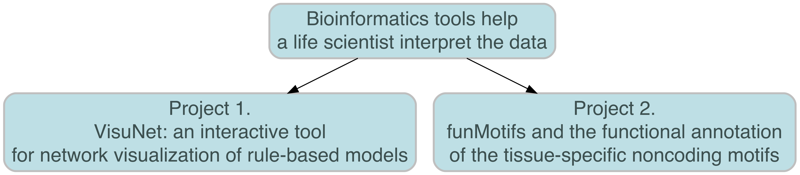

## Project 1. VisuNet: an interactive tool for network visualization of rule-based models {data-background-image="images/UU-figures-en-2019copy.jpg" .emphasized}

## Explainability make classifiers biologically meaningful {data-background-image="images/UU-figures-en-2019copy.jpg" .emphasized}


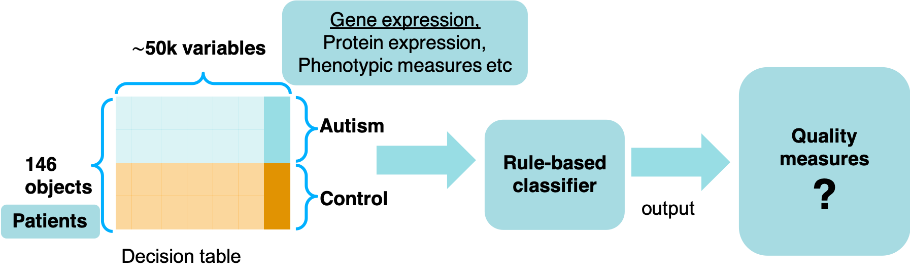

Explainability:

- What combinations of genes/variables contribute to classification?
- What variables/genes are more important?


## Rule-network (RN) construction  {data-background-image="images/UU-figures-en-2019copy.jpg"}


Interactions are discovered from transparent classifiers, such as rule-based classifiers (RBC). 


<br><br>
The conjuncts are co-predictive of the decision.

Nodes - conjuncts in rules, ie. features with their values occurring in the rules

Edge - connects two nodes if the corresponding conjuncts occur in the same rule. 

RNs are built for each decision (outcome class).


## VisuNet {data-background-image="images/UU-figures-en-2019copy.jpg"}


<center></center>


- RN visualisation tool implemented as an R package, 
- helps identifying the strongest features and their values and the interdependencies in an ensemble of rules,
- easy to use due to an interactive interface, 
- applicable for any rule-based classifier in a correct format,
- available on GitHub: https://github.com/komorowskilab/VisuNet

<center>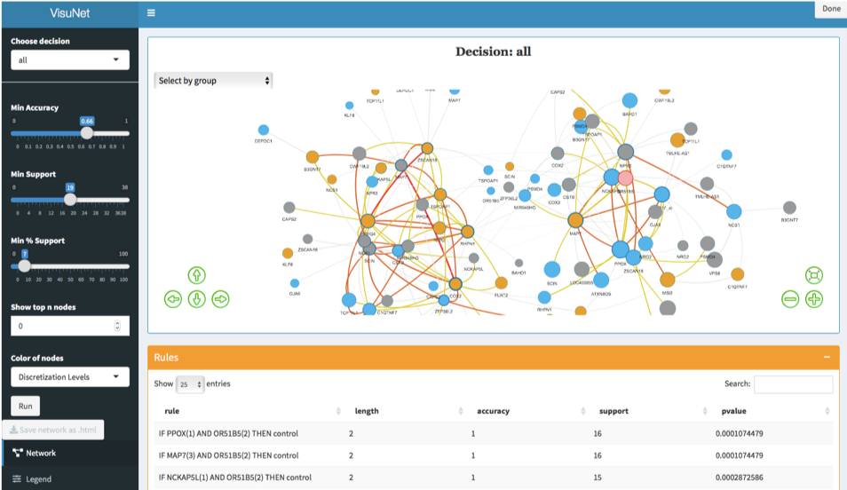</center>


## Applications {data-background-image="images/UU-figures-en-2019copy.jpg"}

```{r, echo =FALSE}
collapse_rows_dt <- data.frame(Dataset = c(paste0(rep("Autism (MG)", 1),footnote_marker_number(1)), 
                                           paste0(rep("SIV (FB&ZK)", 4),footnote_marker_number(2)),
                                           paste0(rep("ULSAM (KD)", 1),footnote_marker_number(3)),
                                           paste0(rep("Synthetic data (KS)",1),footnote_marker_number(4))),
                               `Data type` = c(c('gene expressions microarray'),
                                               rep("gene expression", 4),
                                               rep("metabolite levels", 1),
                                               rep("features correlated within each other and with the decision in the interval 0.1-1", 1)),
                               `N objects` = c(c('146 patients: 82 autistic and 64 healthy boys'),
                                              rep('22 rhesus macaque:\n 10 infected in less than 4 challenges (Early) and 12 infected in more than 6 challenges (Late)', 4),
                                              c('963 patients: 134 type 2 diabetes (T2D) and 829 non-diabetes (ND)'),
                                              rep("500 objects: 250 D1 and 250 D2",1)
                                 
                               ),
                               Decision = c(rep("Autism vs Control", 1), 
                                           rep("Early vs Late", 4),
                                           rep("ND (non-diabetes) vs T2D (type 2 diabetes)", 1),
                                           rep("D1 vs D2",1)),
                              Models =c( c("-"),
                              c("W0", "W16", "W32", "C1"),
                              c("-"),
                              c("100 models")),
                              `N features` = c(c(35),
                                              c(597,1068,723,448),
                                              c(19),
                                              c(25)),
                              `Model quality` = c(c('80%'),
                                                  c('95%','100%','100%','95%'),
                                              c('67%'),
                                              c('from 48% to 100%'))
                             
                               )


kable(collapse_rows_dt, format = 'html', align = rep("c",7),escape = F, col.names = c("Dataset",
                           "Data type",
                           "#objects",
                           "Decision",
                           "Models",
                           "#features",
                           "Model quality")) %>%
  kable_styling(full_width = F, font_size = 13,position = "center") %>%
  column_spec(1, bold = T) %>%
  column_spec(2, width = "10em") %>% 
  collapse_rows(columns = 1:4, valign = "middle") %>%
  footnote(general = "Data sorce",
           number = c("Alter, M.D., et al., 2011",
                      "Barrenäs, F., et al., 2019",
                      "", "Garbulowski, M., et al., 2019 ")
           )

```


<h5><p align="left">MG - Mateusz Garbulowski</p></h5>
<h5><p align="left">FB&ZK - Fredrik Barrenäs & Zeeshan Khaliq</p></h5>
<h5><p align="left">KD - Klev Diamanti</p></h5>
<h5><p align="left">KS - Karolina Smolinska</p> </h5>

## Case-control studies of autism - sample RN {data-background-image="images/UU-figures-en-2019copy.jpg"}

<iframe src='images/net_Autism_fig_new1.html' style='height:800px;width:800px'></iframe> 

## Case-control studies of autism - sample RN {data-background-image="images/UU-figures-en-2019copy.jpg"}

<center>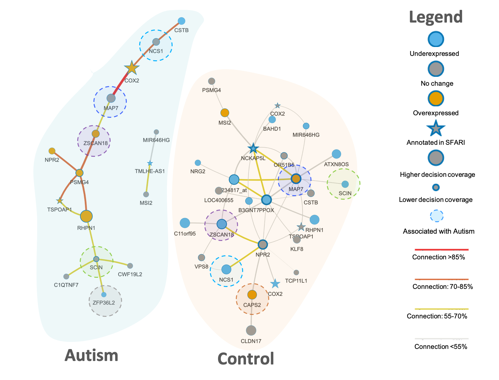</center>

4 genes were previously reported in the SFARI Gene database of autism associations: COX2,  TMLHE,  NCKAP5L and TSPOAP1.

Several genes identified in the literature, which need to be verified: ZSCAN18, SCIN, NCS1, CAPS2, ZFP36L2.


## A  potential important role of MAP7 and COX2 interdependecy in autism {data-background-image="images/UU-figures-en-2019copy.jpg"}

<div id="left">
The strongest interdependency is visible between COX2 and MAP7. 
  
COX2 regulates anxiety behavior in the mouse model (Wong, C.T., et al., 2019)

MAP7 is required for axon growth and branch formation during embryonic brain formation.
The association of MAP7 with autism and schizophrenia was previously reported (Tymanskyj, S.R., et al., 2017)

RN may suggest a link between embryonic development events and anxiety behaviour.

</div>

<div id="right">
<center></center>

</div>

## Project 1 - Summary  {data-background-image="images/UU-figures-en-2019copy.jpg"}

- VisuNet is conceptually simple, but useful for the interdependencies discovery in RBCs,
- RN  identifies different combinations of features and their  discretisation levels that are associated with decisions,
- RN helps explain the differences beteen the classes,
- In the the autism-control RN confirms some known genes associated with autism,
- RN may suggest a new functionality for other of the attributes, e.g. MAP7 and CAPS2


The manuscript will be finished by the end of this year.

## Project 2: funMotifs and the functional annotation of the tissue-specific noncoding mutations {data-background-image="images/UU-figures-en-2019copy.jpg"}

The gene expression  is regulated by transcription factors (TFs) through binding to TF biding sites (motifs).  
To understand how the genes as regulate, we need to know what determined functionality of TF motifs. 

We incorporated data from large-scale genomics platforms including ENCODE, RoadMap Epigenomics and FANTOM to characterize the tissue-specific functional TF motifs.

As the results funMotifs was developed by Husen M. Umer.
I was mainly working on the framework applications.

Two manuscripts were written based on the Project 2.


## funMotifs freamwork {data-background-image="images/UU-figures-en-2019copy.jpg"}

<div id="left">
<b> funMotifs content:</b>

- Annotations for motifs of ~500 TFs in 15 tissues
- Annotations: 
  - TF peak, 
  - DNase1 site,
  - Chromatin state,
  - Replication domain,
  - …
  
<b> Definition of candidate functional regulatory mutations (CFRMs):</b> 

In the tissue(s) relevant for the variant.

- Overlap a TF motif and change entropy by at least |0.3|
- TF expression > 0
- DNaseI peak
- Functionality score > 2.5 or TF-peak

<center>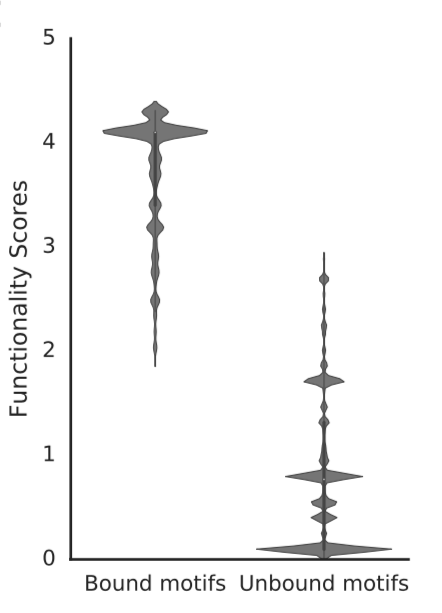</center>
</div>

<div id="right">
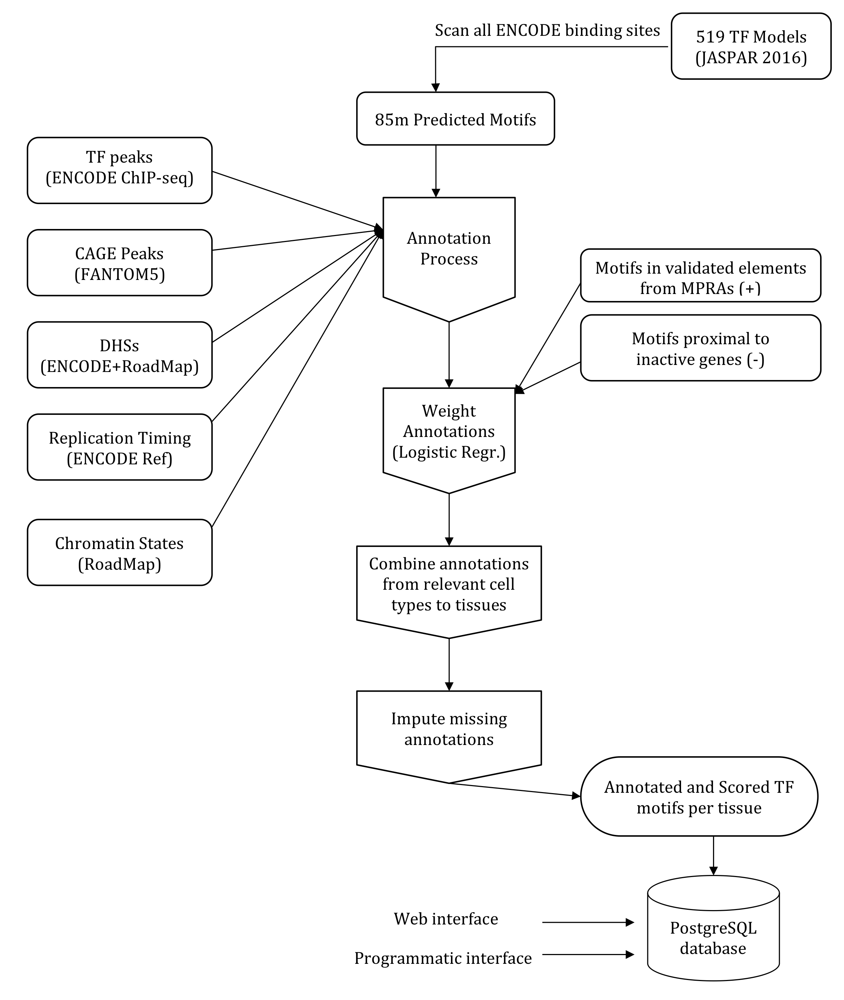

</div>

## Manuscript 1 {data-background-image="images/UU-figures-en-2019copy.jpg"}
<center>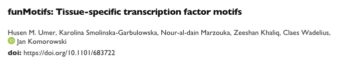<center>

<div id="left">
<b>Applications:</b>

- SNPs and short indels from 1000 Genome project (HU & KS)
- eQTL SNPs from the GTEx data portal v7 (HU & KS)
- SNPs from GWAS Catalogue and SNPs in LD with GWAS SNPs ()(KS)

<br><br>
<h5>HS - Husen M. Umer</h5>
<h5>KS - Karolina Smolinska</h5>
</div>

<div id="right">
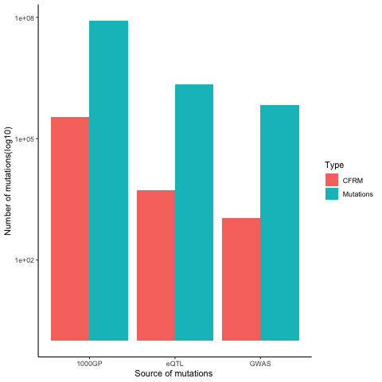
</div>

## Comparison to existing annotation databases {data-background-image="images/UU-figures-en-2019copy.jpg"}

2,219,330 eQTL SNPs were annotated using funMotifs, RegulomeDB and HaploReg.

<div id="left">
```{r, echo =FALSE}
funMotifs <- c("No", "Yes", "Yes", "Yes")
RegulomeDB <- c("Yes", "Yes", "Yes", 'No')
HaploReg <-c("Yes", "No", "Yes", 'No')
data <- data.frame(funMotifs,RegulomeDB, HaploReg )
rownames(data) <- c("Genome wide","Functionality score","Functional annotations","Tissue Specificity")
knitr::kable(data)%>%
  kable_styling(font_size = 18)
```
</div>

<div id="right">
<center>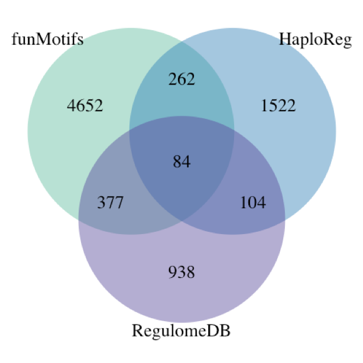</center>
</div>

<br><br><br><br><br><br><br><br><br><br><br><br><br><br><br><br><br><br><br>
RegulomeDB: Boyle,A.P., et al. (2012) 

HaploReg: Ward,L.D., et al. (2016) 

## Overview of the candidate functional GWAS SNP rs8103622 in breast tissue {data-background-image="images/UU-figures-en-2019copy.jpg"}

<center>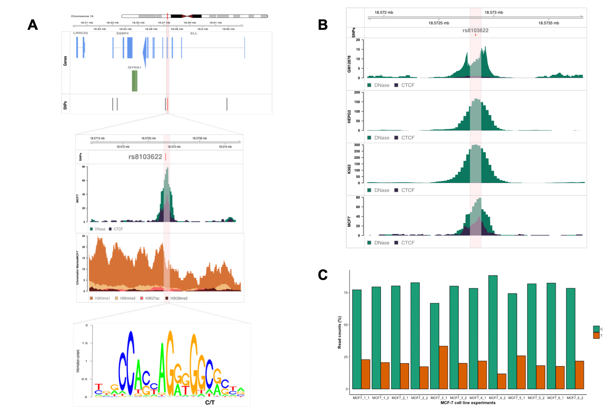</center>

## Manuscript 2 {data-background-image="images/UU-figures-en-2019copy.jpg"}

<center>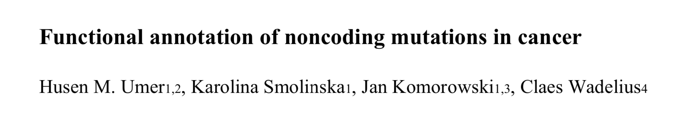</center>

<b>The Aim of the study</b>

Functional annotation of mutations in the Pan Cancer Analysis of Whole Genomes consortium data for 2,500 cancer genomes in 37 cancer types. 
 **the iverview of mutation plot**

## Vep_results  {data-background-image="images/UU-figures-en-2019copy.jpg"}

<center>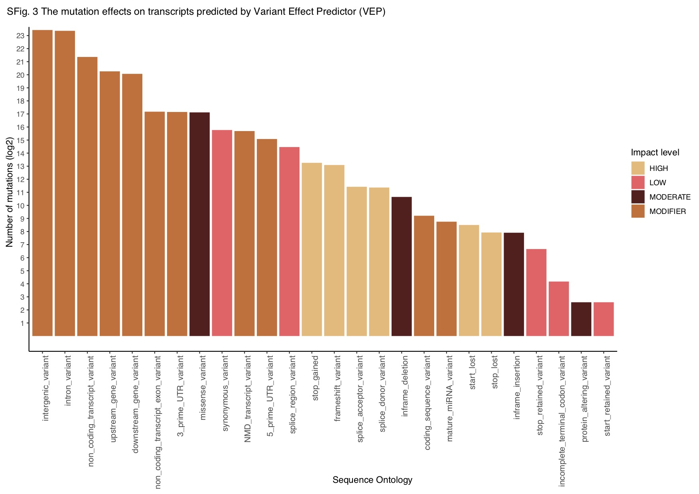</center>

## Pancancer {data-background-image="images/UU-figures-en-2019copy.jpg"}

<center>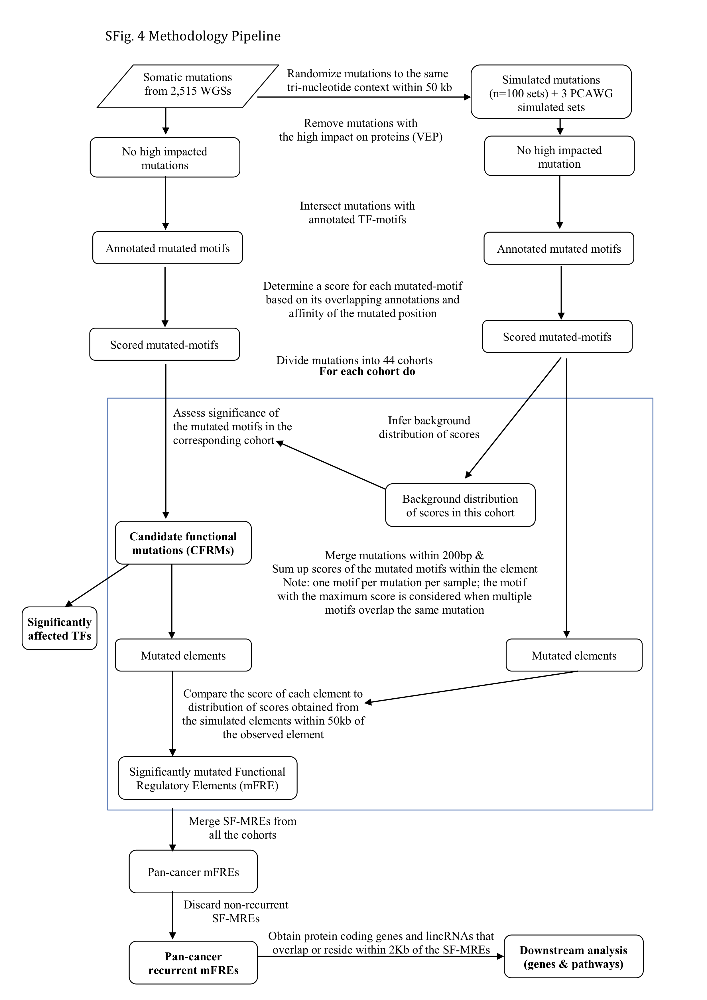</center>

## CEBP mutatation {data-background-image="images/UU-figures-en-2019copy.jpg"}

## Project 2 - Summary  {data-background-image="images/UU-figures-en-2019copy.jpg"}

- funMotifs was implemented as a command-line pipeline (https://github.com/komorowskilab/funMotifs) and a web-based interface: http://bioinf.icm.uu.se/funmotifs.


## Future plans {data-background-image="images/UU-figures-en-2019copy.jpg"}

- Project 1.  - implement the possibility to annotate the RN attributes using biological properties of the input datatypes and various databases, e.g. GO terms for a gene expresession data. 

- Project 2. - Modification of the funMotifs algorithm to improve indetification of the false positive regulatory motifs. We are planning to continue research on the functional annotation of motifs using funMotifs. We would like to extend the functional motifs definition in terms of the conservation of the individual nucleotides in transcription factor motifs.  

- Project 3. on identification and visualization of interdependent genes that discern patients in the case-control studies of autism spectrum disorders by combining multiple, rule-based classifiers. 

- Project 4.- indetification of potential biomarkers that discern glioma subtypes using CFRMs from the COSMIC-available mutations for gliomas. We intersected the results with the differenialy expressed genes based on the TCGA and GTEx databases.

##  {data-background-image="images/UU-figures-en-2019copy.jpg"}

<h5> 
**Publications: **

1.	Husen M. Umer, **Karolina Smolinska-Garbulowska**, Nour-al-dain Marzouka, Zeeshan Khaliq, Claes Wadelius, Jan Komorowski, funMotifs: Tissue-specific transcription factor motifs, 2019, bioRxiv 683722; doi: https://doi.org/10.1101/683722 (subbmited)

2.	Husen M. Umer, **Karolina Smolinska-Garbulowska**, Jan Komorowski, Claes Wadelius, Functional annotation of noncoding mutations in cancer, 2019(manuscript)

3.	Marco Cavalli, Nicholas Baltzer, Gang Pan, José Ramón Bárcenas Walls, **Karolina Smolinska Garbulowska**, Chanchal Kumar, Stanko Skrtic, Jan Komorowski, and Claes Wadelius. Studies of liver tissue identifies functional gene regulatory elements associated to gene expression, type 2 diabetes and other metabolic diseases, Human genomics 13, no. 1 (2019): 20

4.	Mateusz Garbulowski, Klev Diamanti, **Karolina Smolinska-Garbulowska**, Patricia Stoll, Susanne Bornelöv, Aleksander Øhrn, Jan Komorowski, (2019), R.ROSETTA: a package for analysis of rule-based classification models, bioRxiv 625905; doi: https://doi.org/10.1101/625905
These authors contributed equally to the work as second authors. </h5>

##  {data-background-image="images/UU-figures-en-2019copy.jpg"}


 <h5> 
**Posters:**

1.	Michal J. Dabrowski, Michal Draminski, Klev Diamanti, Mateusz Garbulowski, **Karolina Smolinska**, Jacek Koronacki, Jan Komorowski. Identification of the boundary between common and ancestry-dependent levels of gene expression of Homo sapiens adaptive immune system. Systems Biology: Networks, Cold Spring Harbor Laboratory, Cold Spring Harbor, USA 14-18 March 2017.
2.	Mateusz Garbulowski, **Karolina Smolinska**, Klev Diamanti, Patricia Stoll, Zeeshan Khaliq, Sara Younes, Behrooz Torabi, Susanne Bornelöv, Jan Komorowski. RROSETTA: a toolkit for creating rough set models. Swedish Bioinformatics Workshop 2017, Uppsala, Sweden, 13-14 November 2017.
3.	Mateusz Garbulowski, **Karolina Smolinska**, Klev Diamanti, Patricia Stoll, Zeeshan Khaliq, Sara Younes, Behrooz Torabi, Susanne Bornelöv, Jan Komorowski. RROSETTA: a toolkit for creating rough set models. Swedish Epigenetics and Chromatin Meeting, EpiChrom 2017, Uppsala, Sweden, 30 November - 1 December 2017.
4.	**Karolina Smolinska-Garbulowska**, Steven O. O. Anyango, Jan Komorowski, VisuNet: an interactive tool for rule network visualization of rule-based models, SciLifeLab Science Summit 2019, Artificial Intelligence for Life Sciences, Uppsala, May 15, 2019

**Presentation: **

1.	**Karolina Smolinska-Garbulowska**, VisuNet: an interactive tool for rule network visualization of rule-based models, the awarded Flash Talk, SciLifeLab Science Summit 2019, Artificial Intelligence for Life Sciences, Uppsala, May 15, 2019
</h5>


## Acknowledgements {data-background-image="images/UU-figures-en-2019copy.jpg"}

<style type="text/css">
  .reveal p {
    text-align: left;
  }
  .reveal ul {
    display: block;
  }
  .reveal ol {
    display: block;
  }  
</style>


Jan Komorowski Laboratory

Claes Wadelius Laboratory

Manfred Grabherr

