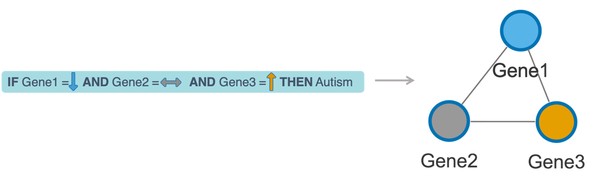

```{r setup, include=FALSE}
knitr::opts_chunk$set(widgetframe_widgetsdir = 'widgets')
library(visNetwork, quietly = TRUE)
library(widgetframe,  quietly = TRUE)
library(kableExtra, quietly = TRUE)
library(VisuNet, quietly = TRUE)
library(DiagrammeR, quietly = TRUE)
library(knitr, quietly = TRUE)
library(cowplot, quietly = TRUE)

```

## Introduction {data-background-image="images/UU-figures-en-2019copy.jpg" .emphasized}
<span class="emphasized">Pay attention to this!</span>

<section style="text-align: left;">
Left-align: This works to align text left on this slide only.
</section>

## {data-background-image="images/UU-figures-en-2019copy.jpg"}


## Project 1. VisuNet: an interactive tool for network visualization of rule-based models {data-background-image="images/UU-figures-en-2019copy.jpg" .emphasized}


## Rule-network (RN) construction  {data-background-image="images/UU-figures-en-2019copy.jpg"}





## VisuNet {data-background-image="images/UU-figures-en-2019copy.jpg"}


* an R package 
* Publicly available on GitHub: https://github.com/komorowskilab/VisuNet


## Data overview {data-background-image="images/UU-figures-en-2019copy.jpg"}

```{r, echo =FALSE}
collapse_rows_dt <- data.frame(Dataset = c(rep("Autism (MG)", 1), 
                                           rep("Amara (FB&ZK)", 4),
                                           rep("ULSAM (KD)", 1),
                                           rep("Synthetic data (KS)",3)),
                               `N objects` = c(c('146 patients: 82 autistic and 64 healthy boys'),
                                              rep('22 rhesus macaque:\n 10 infected in less than 4 challenges (Early) and 12 infected in more than 6 challenges(Late)', 4),
                                              c('963 patients: 134 T2D and 829 ND'),
                                              rep("120 obejcts: 60 D1 and 60 D2",3)
                                 
                               ),
                               Decision = c(rep("Autism vs Control", 1), 
                                           rep("Early vs Late", 4),
                                           rep("ND (non-diabetes) vs T2D (type 2 diabetes)", 1),
                                           rep("D1 vs D2",3)),
                              Models =c( c("-"),
                              c("W0", "W16", "W32", "C1"),
                              c("-"),
                              c("weak correlation (0.2-0.5)", "medium correlation (0.2-0.7)", "strong correlation (0.5 -0.9)")),
                              `N features` = c(c('mcfs is running'),
                                              c(597,1068,723,448),
                                              c(19),
                                              c(18,18,18)),
                              `Model quality` = c(c('-'),
                                                  c('95%','100%','100%','95%'),
                                              c('67%'),
                                              c('59%','76%','93%')),
                              `Visunet Param` = c(c('-'),
                                                   c('Min. accuracy = 80%, min decision coverage =0.6, N top nodes=20',
                                                     rep('”',3)),
                                                     c('-'),
                                                     rep('-',3))
                               )


kable(collapse_rows_dt, format = 'html', align = "c") %>%
  kable_styling(full_width = F, font_size = 13,position = "center") %>%
  column_spec(1, bold = T) %>%
  column_spec(2, width = "10em") %>% 
  collapse_rows(columns = 1:2, valign = "top")

```

<h5><p align="left">MG - Mateusz Garbulowski</p></h5>
<h5><p align="left">FB&ZK - Fredrik Barrenäs & Zeeshan Khaliq</p></h5>
<h5><p align="left">KD - Klev Diamanti</p></h5>
<h5><p align="left">KS - Karolina Smolinska</p> </h5>

## Case-control studies of autism spectrum disorders - sample RN {data-background-image="images/UU-figures-en-2019copy.jpg"}

Top 10% 
<iframe src='net.html' style='height:500px;width:700px'></iframe> 

## MAP7 and COX2 interdependecies {data-background-image="images/UU-figures-en-2019copy.jpg"}

## Project 1 - Summary  {data-background-image="images/UU-figures-en-2019copy.jpg"}


## Project 2: funMotifs and the functional annotation of the tissue-specific noncoding mutations {data-background-image="images/UU-figures-en-2019copy.jpg"}

Aims of the project were identification and analysis of significant functional motifs in non coding region of the human genome.

The

funMotifs was developed by Husen M. Umer and I was mainly working on the framework applications.

Two manuscripts were written based on the Project 2.


## funMotifs freamwork{data-background-image="images/UU-figures-en-2019copy.jpg"}

<div id="left">
<b> funMotifs content:</b>

- Annotations for motifs of ~500 TFs in 15 tissues
- Annotations: 
  - TF peak, 
  - DNase1 site,
  - Chromatin state,
  - Replication domain,
  - …
  
<b> Definition of candidate genetic variant:</b> 
In the tissue(s) relevant for the variant

- Overlap a TF motif and change entropy by at least |0.3|
- TF expression > 0
- DNaseI peak
- Functionality score > 2.5 or TF-peak

<center></center>
</div>

<div id="right">


</div>

## funMotifs applications {data-background-image="images/UU-figures-en-2019copy.jpg"}

- 1000 Genome project
- eQTL SNPs were downloaded from the GTEx data portal v7
- SNPs from GWAS Catalogue 

## Overview of the candidate functional GWAS SNP rs8103622 in breast tissue {data-background-image="images/UU-figures-en-2019copy.jpg"}


## Pancancer {data-background-image="images/UU-figures-en-2019copy.jpg"}


## Project 2 - Summary  {data-background-image="images/UU-figures-en-2019copy.jpg"}


## Future plans {data-background-image="images/UU-figures-en-2019copy.jpg"}


##  {data-background-image="images/UU-figures-en-2019copy.jpg"}

<h5> 
**Publications: **

1.	Husen M. Umer, **Karolina Smolinska-Garbulowska**, Nour-al-dain Marzouka, Zeeshan Khaliq, Claes Wadelius, Jan Komorowski, funMotifs: Tissue-specific transcription factor motifs, 2019, bioRxiv 683722; doi: https://doi.org/10.1101/683722 (subbmited)

2.	Husen M. Umer, **Karolina Smolinska-Garbulowska**, Jan Komorowski, Claes Wadelius, Functional annotation of noncoding mutations in cancer, 2019(manuscript)

3.	Marco Cavalli, Nicholas Baltzer, Gang Pan, José Ramón Bárcenas Walls, **Karolina Smolinska Garbulowska**, Chanchal Kumar, Stanko Skrtic, Jan Komorowski, and Claes Wadelius. Studies of liver tissue identifies functional gene regulatory elements associated to gene expression, type 2 diabetes and other metabolic diseases, Human genomics 13, no. 1 (2019): 20

4.	Mateusz Garbulowski, Klev Diamanti, **Karolina Smolinska-Garbulowska**, Patricia Stoll, Susanne Bornelöv, Aleksander Øhrn, Jan Komorowski, (2019), R.ROSETTA: a package for analysis of rule-based classification models, bioRxiv 625905; doi: https://doi.org/10.1101/625905
These authors contributed equally to the work as second authors. </h5>

##  {data-background-image="images/UU-figures-en-2019copy.jpg"}


 <h5> 
**Posters:**

1.	Michal J. Dabrowski, Michal Draminski, Klev Diamanti, Mateusz Garbulowski, **Karolina Smolinska**, Jacek Koronacki, Jan Komorowski. Identification of the boundary between common and ancestry-dependent levels of gene expression of Homo sapiens adaptive immune system. Systems Biology: Networks, Cold Spring Harbor Laboratory, Cold Spring Harbor, USA 14-18 March 2017.
2.	Mateusz Garbulowski, **Karolina Smolinska**, Klev Diamanti, Patricia Stoll, Zeeshan Khaliq, Sara Younes, Behrooz Torabi, Susanne Bornelöv, Jan Komorowski. RROSETTA: a toolkit for creating rough set models. Swedish Bioinformatics Workshop 2017, Uppsala, Sweden, 13-14 November 2017.
3.	Mateusz Garbulowski, **Karolina Smolinska**, Klev Diamanti, Patricia Stoll, Zeeshan Khaliq, Sara Younes, Behrooz Torabi, Susanne Bornelöv, Jan Komorowski. RROSETTA: a toolkit for creating rough set models. Swedish Epigenetics and Chromatin Meeting, EpiChrom 2017, Uppsala, Sweden, 30 November - 1 December 2017.
4.	**Karolina Smolinska-Garbulowska**, Steven O. O. Anyango, Jan Komorowski, VisuNet: an interactive tool for rule network visualization of rule-based models, SciLifeLab Science Summit 2019, Artificial Intelligence for Life Sciences, Uppsala, May 15, 2019

**Presentation: **

1.	**Karolina Smolinska-Garbulowska**, VisuNet: an interactive tool for rule network visualization of rule-based models, the awarded Flash Talk, SciLifeLab Science Summit 2019, Artificial Intelligence for Life Sciences, Uppsala, May 15, 2019
</h5>


## Acknowledgements {data-background-image="images/UU-figures-en-2019copy.jpg"}

<style type="text/css">
  .reveal p {
    text-align: left;
  }
  .reveal ul {
    display: block;
  }
  .reveal ol {
    display: block;
  }  
</style>


Jan Komorowski Laboratory

Claes Wadelius Laboratory

Manfred Grabherr

